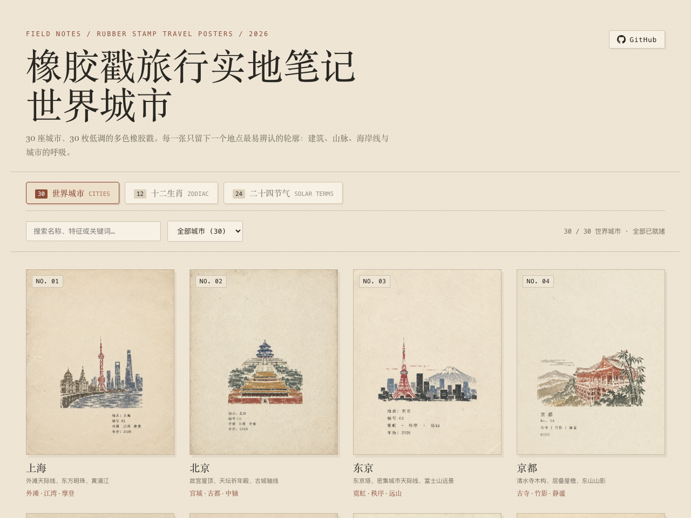

# 橡胶戳艺术印记 · 世界城市 / 十二生肖 / 二十四节气

复古手工多色橡胶戳印艺术画廊，共收录 66 枚印章作品（世界城市 30 枚、十二生肖 12 枚、二十四节气 24 枚）。画面去尽文字与杂乱排版，仅保留最纯粹的雕刻图章主体与温暖陈旧米白纤维纸张质感。

## 在线体验

- **GitHub Pages 演示**：<https://holynova.github.io/rubber-stamp-world-cities/>
- **GitHub 源码仓库**：<https://github.com/holynova/rubber-stamp-world-cities>



### 手机扫码体验

手机扫描二维码直接访问画廊：


## 系列画廊

1. **世界城市（30 幅）**：精选 30 座全球名城地标、天际线与旅行手账印记。
2. **十二生肖（12 幅）**：子鼠、丑牛、寅虎、卯兔、辰龙、巳蛇、午马、未羊、申猴、酉鸡、戌狗、亥猪瑞兽印记。
3. **二十四节气（24 幅）**：春生、夏长、秋收、冬藏，24 幅凝结于宣纸之上的时序物候印章。

## 本地运行

```bash
npm run dev
# 或
npm run serve
```

