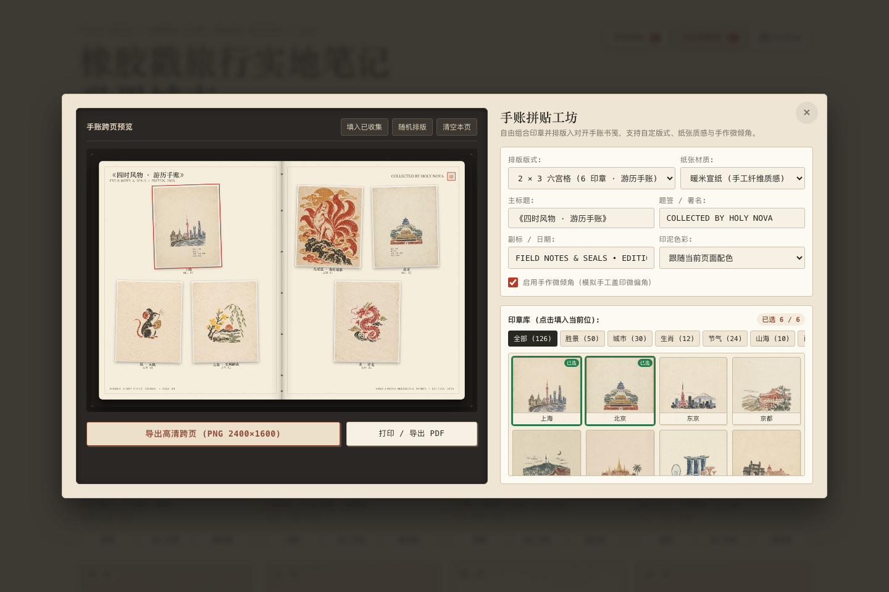

# 橡胶戳艺术印记 · 世界城市 / 名胜风景 / 古诗名句 / 十二生肖 / 二十四节气 / 山海神异

复古手工多色橡胶戳印艺术画廊，收录 176 枚纯印章艺术作品（世界城市 30 枚、名胜风景 50 枚、古诗名句 50 枚、十二生肖 12 枚、二十四节气 24 枚、山海神异 10 枚）。画面剥离文字与排版干扰，保留纯粹版画雕刻图章主体与米白纤维纸张质感。

## 核心交互功能

1. **手账拼贴工坊（Stamp Journal Studio）**：
   - 将心仪或已收集的印章排版入对开手账书笺，支持 4 套经典版式（四宫格、六宫格、八宫格、1+4 焦点版）。
   - 提供宣纸、牛皮纸、点阵手账、青墨水纹等纸张质感，支持手作微倾角、自定义主副题头与题签落款，支持导出 2400×1600 高清跨页或一键打印/PDF。
2. **声音盖章与印记收集册（Stamp Passport）**：
   - 支持一键盖印与基于 Web Audio API 的印章按压触感音效。
   - 本地记录收集进度，支持将已收集印章排入手账本或导出明信片。
3. **藏书票工坊（Ex-Libris Studio）**：
   - 任意印章均可制作藏书票，自定义藏书人姓名、题头铭文、复古边框与纸张色彩，导出 1200×1600 藏书票。
4. **油墨配色切换（Ink Palette）**：
   - 支持实时切换 3 种版画油墨风格：天然原色、水墨黑白（木刻单色）、朱砂红白（传统印泥）。

## 在线体验

- Cloudflare 线上站点：<https://rubber-stamp-world-cities.xiaosang.cc/>
- GitHub Pages 演示：<https://holynova.github.io/rubber-stamp-world-cities/>
- GitHub 源码仓库：<https://github.com/holynova/rubber-stamp-world-cities>




### 手机扫码体验

手机扫描二维码访问画廊：


## 收录系列

1. **世界城市（30 幅）**：精选 30 座全球名城地标、天际线与旅行手账印记。
2. **名胜风景（50 幅）**：中国 50 大 5A 级景区与世界遗产胜景（故宫、长城、颐和园、天坛、兵马俑、西湖、黄山、九寨沟、漓江、张家界、莫高窟、泰山、华山、丽江/玉龙雪山、大熊猫基地、拙政园、乌镇、黄鹤楼、大雁塔、三峡、乐山大佛、峨眉山、龙门石窟、普陀山、鼓浪屿、稻城亚丁、布达拉宫、青海湖、三亚亚龙湾、庐山、武夷山、避暑山庄、宏村、平遥古城、云冈石窟、喀纳斯、天山天池、长白山天池、壶口瀑布、黄果树瀑布、荔波小七孔、凤凰古城、中山陵、大足石刻、少林寺、嘉峪关、纳木错、沙坡头、雁荡山、呼伦贝尔草原），涵盖华北、华东、西南、西北、华中、华南、东北七大地理分区。
3. **古诗名句（50 幅）**：50 句极具画面感的中国经典古诗词（竹外桃花三两枝、独钓寒江雪、大漠孤烟直、轻舟已过万重山、一蓑烟雨任平生等），五大辑分类（春生·花木、夏盛·清荷、秋思·枫江、冬藏·飞雪、天地·旷野），图章正下方铭刻千古名句。
4. **十二生肖（12 幅）**：子鼠、丑牛、寅虎、卯兔、辰龙、巳蛇、午马、未羊、申猴、酉鸡、戌狗、亥猪瑞兽印记。
5. **二十四节气（24 幅）**：春生、夏长、秋收、冬藏，24 幅物候印章。
6. **山海神异（10 幅）**：九尾狐、烛九阴、帝江、白泽、毕方、鲲鹏、饕餮、穷奇、陆吾、夫诸等 10 尊神异版画。

## 本地运行

```bash
npm run dev
# 或
npm run serve
```


